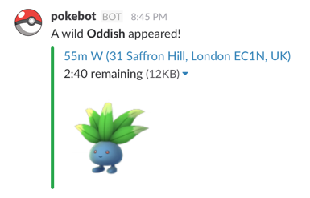

# slack-pokebot [](https://travis-ci.org/kmoe/slack-pokebot)

`slack-pokebot` is a little program that posts a message to Slack whenever a new Pokémon is detected near your location. You can install it for your own Slack team in ten minutes!



## Features

- Posts one message for each interesting Pokémon near target location
- Configurable algorithm to determine which Pokémon are interesting
- Links to Google Map directions from start location to Pokémon location
- Colour coded by rarity
- Alerts `@here` when a rare Pokémon appears
- Cute Pokémon image on each message

## Quick start

In order to install `slack-pokebot`, you'll need to have permission to add an Incoming Webhook to your Slack team (or be an admin), and will need a Heroku* account.

### 1. Add Incoming Webhook to Slack

Make sure you're logged in to the Slack team you want to install slack-pokebot on, and go to https://YOUR_TEAM_NAME.slack.com/apps/new/A0F7XDUAZ-incoming-webhooks.

Choose the channel you want the bot to post to (ours is called #pokemon-notify), make a note of the webhook URL, and customise the name of the bot if you like.

Save the settings.


### 2. Deploy to Heroku

Now click here, and follow the instructions:

[](https://heroku.com/deploy)

**Please note that if you're using a free dyno you'll need to enable the `worker` dyno - see [this issue](https://github.com/kmoe/slack-pokebot/issues/19).**

#### Logging

We've used [Loggly](https://loggly.com), a cloud-based logs service, during development and have left in the option for you to use it if you choose. Just set both of the `LOGGLY` environment variables with details from your account.

Otherwise, the easiest way to spool logs to a terminal is to run:
```
heroku logs --app YOUR_APP_NAME -t
```

## About

Idea and code by [@katyemoe](https://twitter.com/katyemoe). Awesome metrics feature and many other improvements by [@ChrisJMajor](https://twitter.com/ChrisJMajor). Come work with us at [Improbable](https://improbable.io).

Still under active development - features should not be considered stable.

===

*It's also easy to install on any other cloud platform that can run node.js programs - PRs to add instructions welcome!
